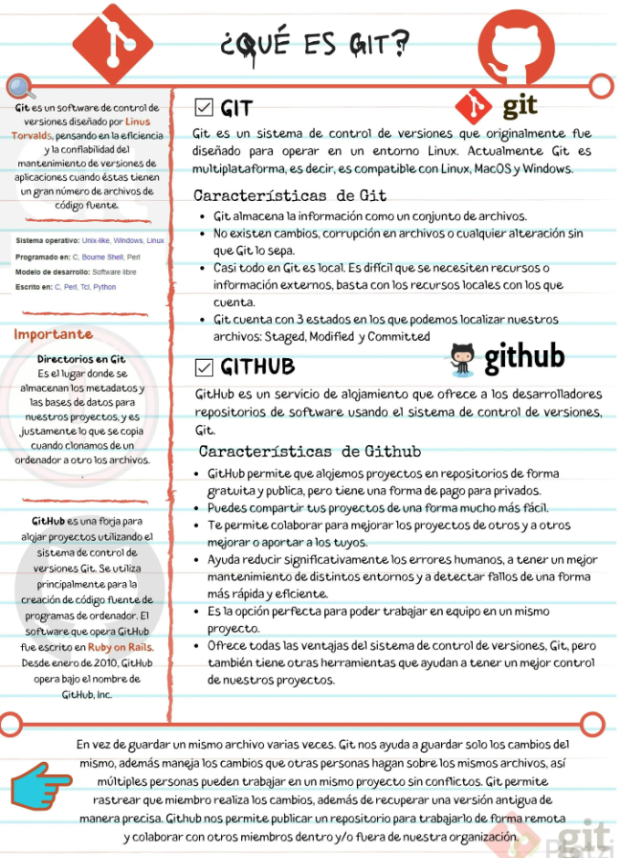
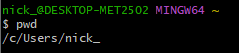
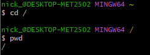
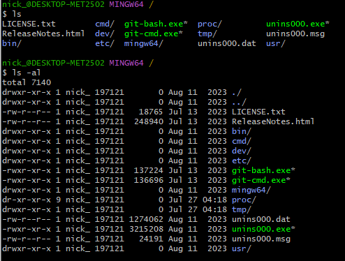
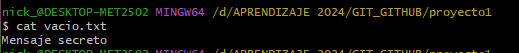

# SECCION 1. INTRODUCCIÓN A GIT

## 1. ¿Qué es Git?

El video introduce Git y GitHub, explicando por qué son herramientas obligatorias para cualquier programador. En lugar de guardar múltiples copias de un mismo archivo (como archivo_v1, archivo_final, archivo_final_ahora_si), un sistema de control de versiones como Git rastrea únicamente las modificaciones exactas que se le hacen al código a lo largo del tiempo.

Además, marca una diferencia fundamental: Git es la herramienta local en tu computadora, mientras que GitHub es la plataforma en la web para colaborar y mostrar tu trabajo al mundo.

Explicación a Detalle
Para entenderlo a cabalidad, hay que dividir la información en tres grandes bloques:

**1. ¿Qué problema resuelve Git?**

Cuando varias personas trabajan en un mismo código, es muy fácil sobrescribir o borrar accidentalmente el trabajo de otro. Git soluciona esto permitiendo que múltiples desarrolladores trabajen en el mismo proyecto sin "pisarse".

Historial preciso: Si algo se rompe, Git te dice exactamente qué línea de código cambió, cuándo y quién lo hizo.

Viaje en el tiempo: Si una versión nueva tiene errores irreparables, puedes volver a una versión anterior que sí funcionaba con total precisión.

**2. La diferencia entre Git y GitHub**

Es común confundirlos, pero tienen roles distintos:

Git (El motor local): Es el programa que corre en tu propia máquina a través de la terminal o línea de comandos. Aquí es donde ejecutas órdenes como add (agregar cambios), commit (confirmar cambios), merge (fusionar versiones) o pull (traer actualizaciones).

GitHub (La plataforma social/nube): Es el sitio web donde alojas los proyectos que gestionas con Git. Funciona como una red social para código. Permite que otros vean tu trabajo, colaboren contigo desde otras partes del mundo y sirve como tu portafolio u "hoja de vida" profesional ante las empresas.

**3. El objetivo de tu aprendizaje**

La clase hace una advertencia importante: muchos programadores solo aprenden lo mínimo necesario (add, commit, push, pull) y se pierden del verdadero poder de la herramienta.
El objetivo es que domines el flujo de trabajo completo a un nivel profesional. Esto incluye crear "ramas" (versiones paralelas de tu código para probar cosas nuevas sin dañar el proyecto principal), fusionarlas, resolver conflictos cuando dos personas modifican la misma línea y gestionar tu repositorio remoto en la web.



## 2. ¿Porque usar un sistema de control de versiones como Git?

Usar un sistema de control de versiones como Git tiene múltiples ventajas, especialmente en entornos de desarrollo colaborativo y dinámico. Aquí te detallo algunas razones clave para adoptarlo:

**1. Colaboración:**

Git facilita la colaboración entre múltiples desarrolladores. Permite que varios desarrolladores trabajen simultáneamente en el mismo proyecto sin interferir en el trabajo de los demás. Cada desarrollador trabaja en su propia "rama" y luego puede fusionar su trabajo con la rama principal o con las ramas de otros compañeros.

**2. Control de Versiones:**

Permite mantener un historial completo de todos los cambios realizados en el código. Cada cambio se guarda como un "commit" con una descripción asociada, lo que permite entender quién hizo qué cambios y por qué. Esto es crucial para rastrear el origen de los errores y entender la evolución del proyecto.

**3. Desarrollo Descentralizado:**

Git es un sistema distribuido, lo que significa que cada desarrollador tiene una copia completa del repositorio, incluyendo todo el historial de cambios. Esto permite trabajar de manera independiente y segura, sin necesidad de una conexión constante a un servidor central.

**4. Gestión de Ramas:**

Las ramas en Git permiten a los desarrolladores experimentar y desarrollar funcionalidades independientemente. Las ramas pueden ser creadas para diferentes características, versiones o para pruebas específicas, y pueden ser fusionadas cuando los cambios estén listos para ser integrados al proyecto principal.

**5. Respaldo y Restauración:**

Dado que cada clon del repositorio es una copia de seguridad completa, perder datos es mucho menos probable. Además, si algo sale mal, es fácil revertir a versiones anteriores de los archivos o incluso del proyecto completo.

**6. Integración con Herramientas de Desarrollo:**

Git se integra bien con numerosas plataformas de desarrollo, sistemas de integración continua/despliegue continuo (CI/CD), y herramientas de gestión de proyectos, lo que permite automatizar partes del flujo de trabajo de desarrollo y asegurar la calidad del software.

**7. Seguridad:**

Puedes configurar Git para trabajar con repositorios remotos a través de protocolos seguros como HTTPS o SSH. Además, Git permite controlar el acceso a diferentes partes del código a través de permisos, asegurando que solo las personas autorizadas puedan hacer cambios críticos.

**8. Acceso Offline:**

Como Git es un sistema distribuido, puedes continuar trabajando en tus archivos localmente, incluso sin acceso a internet. Esto es ideal para situaciones donde la conectividad es un problema o cuando se está en movimiento.

**9. Facilidad de Uso:**

A pesar de su potencia, Git es relativamente fácil de aprender, especialmente las operaciones básicas necesarias para el día a día de un desarrollador. Además, hay una amplia comunidad y muchos recursos de aprendizaje disponibles.

**10. Adopción Extendida:**

Git es el sistema de control de versiones más popular en la actualidad, utilizado por pequeñas startups hasta grandes corporaciones, así como en proyectos open source. Esto significa que hay una gran cantidad de herramientas compatibles y una comunidad activa para obtener soporte.

Estas características hacen de Git una herramienta indispensable para cualquier equipo de desarrollo moderno, optimizando y asegurando el proceso de desarrollo de software.

Archivos de clase: https://static.platzi.com/media/public/uploads/git-github_917f1c24-de6d-4d30-99ca-f47214e6ae16.pdf

**Resumen de la clase**

El video explica cómo Git elimina la mala costumbre de crear múltiples archivos para guardar versiones (como version1.txt, version_nueva.txt, final_final.txt). En lugar de duplicar todo el documento cada vez que haces una modificación, Git funciona como un historial inteligente que guarda únicamente los cambios exactos que haces (por ejemplo, borrar la palabra "tenis" y escribir "carreras").

Este sistema es fundamental al crear software porque rastrea el qué, cuándo y quién de cada línea de código, permitiendo volver al pasado sin perder información.

Para que Git funcione correctamente, se debe trabajar con archivos de texto plano (como archivos de código fuente o .txt). Son archivos puros sin formato visual (sin negritas ni colores), a diferencia de un documento de Word (.docx), lo que permite que Git lea y rastree las modificaciones línea por línea.

Aquí tienes el ciclo de vida de un cambio en Git, paso a paso, traducido a los comandos exactos que debes usar en tu terminal:

**1. Iniciar el motor de Git**

git init: Transforma una carpeta normal de tu computadora en un "repositorio". Básicamente, enciende la base de datos oculta de Git para que empiece a vigilar esa carpeta.

**2. Preparar los cambios (Staging)**

Cuando modificas un archivo, Git lo nota, pero no lo guarda automáticamente. Primero debes pasarlo a una sala de espera.

git add biografia.txt: Le dice a Git: "He hecho cambios en este archivo en particular, prepáralos para guardarlos".

git add .: Es el atajo perfecto. Prepara todos los archivos que hayas modificado en esa carpeta al mismo tiempo.

**3. Guardar la versión definitivamente (Commit)**

git commit -m "Aquí escribes tu mensaje": Toma todo lo que preparaste con el comando add y lo guarda permanentemente en el historial. El mensaje (el texto entre comillas) es crucial para mantener la higiene del proyecto; te servirá en el futuro para saber de un vistazo qué arreglaste o agregaste en ese punto exacto.

**4. Monitorear tu proyecto**

Git ofrece herramientas de diagnóstico para que nunca trabajes a ciegas:

git status: Es tu panel de control. Te dice el estado actual de las cosas (qué archivos has modificado, cuáles ya están preparados con add y cuáles faltan por guardar con commit).

git show: Te muestra una radiografía exacta de los cambios: qué líneas se borraron, cuáles se añadieron, a qué hora y quién fue el autor.

git log biografia.txt: Te despliega todo el historial cronológico de un archivo específico desde que nació.

**5. Trabajar en la nube (Remotos)**

Una vez que tus cambios están guardados localmente, el siguiente paso lógico es compartirlos.

git push y git pull: Son los comandos que usarás para enviar (push) tu historial a un servidor en internet (como GitHub) o para descargar (pull) el código que tus compañeros hayan subido a ese mismo servidor.

## 3. Instalando GitBash en windows

El video es una guía práctica para instalar Git, enfocándose principalmente en Windows. Dado que Windows no es el entorno nativo para la mayoría de las herramientas de programación (como sí lo son Mac y Linux), el instalador de Git hace varias preguntas de configuración.

La clave de la clase es no intimidarse por estas opciones técnicas. El objetivo principal es instalar Git Bash, una herramienta que emulará una consola de Linux dentro de tu Windows, permitiéndote trabajar con los mismos estándares y comandos que usa cualquier ingeniero de software profesional en el mundo.

**Configuración del Instalador**

Al descargar Git desde la página oficial oficial (git-scm.com) y ejecutarlo en Windows, te encontrarás con varias pantallas. Aquí te explico el porqué de las decisiones clave que se toman en el video:

**1. Instalar Git Bash**

Debes asegurarte de marcar la casilla para instalar Git Bash. Esta será tu herramienta principal. Te dará una consola con un signo de dólar ($) donde podrás escribir comandos clásicos de Linux como ls (para listar archivos) o pwd (para ver en qué carpeta estás).

**2. Integración con Windows (PATH)**

El instalador te preguntará desde dónde quieres usar Git. La recomendación es elegir la opción que permite usar Git tanto en Git Bash como desde la consola nativa de Windows o desde otros programas. Esto te da máxima flexibilidad sin romper nada.

**3. Sistema de Seguridad (Open SSL)**

Tendrás que elegir entre el sistema de certificados de Microsoft o Open SSL. Selecciona Open SSL. Es el estándar global de la industria para conexiones seguras y es lo que usarás más adelante para conectarte a servidores remotos como GitHub de forma encriptada.

**4. Los Saltos de Línea (Line Endings)**

Windows y Linux registran la tecla "Enter" de manera distinta en el código. Si no configuras esto bien, el código puede dañarse al colaborar con alguien que usa Mac. Debes elegir la primera opción: esto hace que Git traduzca automáticamente el código al formato universal de Linux cuando lo guardas en el historial, y lo devuelva a formato Windows cuando lo descargas a tu máquina local.

**5. El Emulador de Terminal (MinTTY)**

Se recomienda elegir MinTTY. Es la ventana gráfica de Git Bash. Es más moderna, cómoda y te acostumbra al entorno visual que usan los programadores, alejándote de la antigua consola de comandos tradicional de Windows (cmd).

Para usuarios de Mac y Linux

    - Mac: El instalador funciona visualmente igual que en Windows y el uso es idéntico.
    - Linux: Es aún más sencillo, ya que Git es nativo de este entorno. Solo necesitas abrir la terminal y ejecutar el comando apt install git (en distribuciones como Ubuntu o Debian).

## 4. Instalando Git en OSX
## 5. Instalando Git en Linux

## 6. Editores de código, archivos binarios y de texto plano

**Editores de Código**

Los editores de código son herramientas diseñadas específicamente para la escritura y edición de código fuente. Proporcionan características que facilitan el desarrollo de software, como resaltado de sintaxis, autocompletado, navegación de archivos, y depuración. Existen muchos editores de código, cada uno con sus propias características y ventajas.

**Archivos Binarios**

Los archivos binarios contienen datos en formato binario, es decir, secuencias de bits que no están directamente legibles por humanos. Los programas almacenan información en estos archivos para optimizar el almacenamiento y el rendimiento. Los archivos binarios pueden incluir cualquier tipo de datos, desde aplicaciones ejecutables hasta imágenes, audio, video, y archivos comprimidos.

**Archivos de Texto Plano**

Los archivos de texto plano contienen solo texto sin ningún formato especial o codificación binaria. Son legibles por humanos y se pueden abrir con cualquier editor de texto. Son ampliamente utilizados para documentos simples, scripts, configuraciones, y otros tipos de archivos donde la legibilidad es importante.

Los editores de código suelen trabajar con archivos de texto plano, ya que el código fuente es legible y manipulable. Los archivos binarios, por otro lado, requieren herramientas especializadas para su edición y comprensión.

**Resumen de la clase**

Para escribir código y usar Git, no puedes usar procesadores de texto tradicionales como Microsoft Word. Necesitas un Editor de Código, que es una herramienta diseñada específicamente para leer y escribir "texto plano" puro. El video explica que Git solo puede rastrear cambios exactos línea por línea si el archivo es de texto plano; si usas formatos ricos o binarios, Git pierde su capacidad de mostrarte qué se modificó exactamente por dentro. Para este curso, la herramienta elegida a instalar es Visual Studio Code (VS Code).

Explicación a Detalle

**1. Haz visibles las extensiones de tus archivos**

Como programador, necesitas saber con qué formato exacto estás trabajando. Windows suele ocultar las extensiones (como .docx, .txt, .js) para "simplificarle" la vida al usuario común. La clase te indica que debes ir a la pestaña "Vista" de tu explorador de archivos y activar la opción "Extensiones de nombre de archivo".

**2. La ilusión del texto: Archivos Binarios vs. Texto Plano**

No todos los archivos que contienen palabras son iguales para tu computadora.

Archivos de Word (.docx): Son archivos binarios. Aunque tú en la pantalla veas texto con negritas e imágenes, por debajo el archivo está encriptado en una estructura compleja de ceros y unos. Si lo abres en un editor de código, solo verás símbolos incomprensibles.

Archivos RTF (.rtf): Son un punto intermedio. Son técnicamente texto, pero están llenos de códigos internos y etiquetas ocultas (como \f0) que le indican al sistema cómo formatear las palabras (colores, centrados, etc.).

Archivos de Texto Plano (.txt y todo el código fuente): Es texto puro y limpio. No guarda información de diseño visual. Lo que escribes es la única información que existe.

**3. ¿Por qué Git necesita Texto Plano?**

El superpoder de Git es su precisión. Si estás trabajando en un archivo de texto plano y modificas una palabra, Git te dirá: "En la línea 15, borraste la palabra 'azul' y escribiste 'rojo'".
Git puede almacenar archivos binarios (como un documento de Word o una fotografía), pero si modificas una sola letra en ese Word, Git no podrá leer su interior; simplemente te dirá: "El archivo binario cambió por completo". Por eso, programamos en texto plano.

**4. Instalando tu Editor: Visual Studio Code**

Existen muchos editores (Sublime Text, Atom, Notepad++), pero la industria y el curso se decantan por Visual Studio Code (creado por Microsoft).

Es importante diferenciar: Visual Studio Code es de Microsoft, al igual que GitHub, pero GitHub no es lo mismo que Git (GitHub es la plataforma web, Git es el motor que ya instalaste).

Tip de instalación: Durante la instalación, asegúrate de marcar la casilla "Agregar la acción de 'Abrir con Code'". Esto es un atajo muy útil que te permitirá hacer clic derecho sobre cualquier carpeta en tu computadora y abrirla inmediatamente en tu editor de código para empezar a trabajar.

## 7. Introduccion a la terminal y linea de comandos

**Diccionario de Comandos**

La terminal puede parecer intimidante, pero en realidad solo le estás dando órdenes escritas a tu computadora. Aquí tienes el desglose de las rutas y los comandos que aprendiste:

**1. Entendiendo las Rutas (Paths)**

En Windows: Las rutas usan letras de discos y barras invertidas (ej. C:\Users\MiNombre).

En Linux / Mac (y Git Bash): Todo nace de una sola raíz representada por una barra normal /. En Git Bash, el equivalente a tu disco local C se ve así: /c/Users/MiNombre.

El símbolo ~ (virgulilla): Es un atajo universal que significa "Mi Carpeta de Usuario" (Home). Si ves este símbolo en la consola, sabes que estás en tu zona segura de archivos personales.

**2. Comandos para Navegar**

**Comando pwd:** 

El comando pwd en la línea de comandos significa "print working directory" (imprimir directorio de trabajo). Se utiliza para mostrar la ruta completa del directorio en el que te encuentras actualmente. Por ejemplo, si estás en el directorio /home/usuario/proyectos, al ejecutar pwd se mostrará esa ruta completa. Es útil para verificar tu ubicación actual en el sistema de archivos.
Cuando abrimos git bash y ponemos pwd esta nos indicara la ubicacion por defecto del usuario 



**2. Comando cd:**

El comando cd (abreviatura de "change directory", cambiar de directorio) se utiliza en la línea de comandos para cambiar el directorio de trabajo actual. Al ejecutar cd, puedes navegar a diferentes directorios en tu sistema de archivos.

En Windows, el comando **cd /** funciona de manera similar a como lo hace en sistemas Unix/Linux, pero con algunas diferencias debido a la estructura de archivos de Windows.

En Windows, el sistema de archivos se organiza en unidades (como C:\, D:\, etc.) y cada unidad tiene su propio directorio raíz. Cuando ejecutas cd / en Windows, cambia el directorio actual al directorio raíz de la unidad actual. Por ejemplo:

Si estás en C:\Usuarios\TuNombre, ejecutar cd / te llevará a C:\.
Si estás en D:\Proyectos\MiProyecto, ejecutar cd / te llevará a D:\.
Es importante notar que, a diferencia de Unix/Linux, donde / siempre se refiere al directorio raíz del sistema completo, en Windows, el comando cd / se refiere al directorio raíz de la unidad de disco actual en la que estás trabajando.

cd (Change Directory): Es el equivalente a hacer doble clic en una carpeta para entrar a ella.

    - cd NombreCarpeta: Entras a esa carpeta.
    - cd .. (dos puntos): Te saca de la carpeta actual y te sube un nivel hacia atrás.
    - cd ~ (o solo cd): Te lleva instantáneamente a tu carpeta "Home", sin importar dónde estés.



**3. Comando ls    y    ls -al**

Se utiliza para listar archivos y directorios en el directorio actual o en un directorio específico.

El comando **ls -al** se usa para mostrar todos los archivos, incluidos los ocultos (que empiezan con un punto .), y proporciona un listado detallado de cada archivo o directorio.

Atajo útil: ls -al (la -a muestra archivos ocultos y la -l los muestra en forma de lista detallada). Se puede usar el comando -a o -l por separado o juntos tambien



**4. Comando clear**

Con este comando puedo limpiar la consola. Alternativamente tambien se puede usar **ctrl + L**

**5. Comando mkdir**

El comando mkdir en Git Bash (Windows) se utiliza para crear nuevos directorios. Su nombre es una abreviatura de "make directory" (hacer directorio).

**6. Comando touch**

Este comando es comúnmente usado para crear nuevos archivos o modificar la fecha y hora de última modificación de archivos existentes.

touch nombre_del_archivo.extension

**7. Comando cat**

Es una herramienta versátil que puede servir para leer archivos

cat archivo.txt  : Este comando mostrará el contenido de archivo.txt en la pantalla.



**8. Comando history**

El comando history en Git Bash (Windows) muestra una lista de los comandos que has ejecutado en la sesión actual de la terminal. Esto te permite revisar y reutilizar comandos anteriores sin tener que volver a escribirlos. Solo es escribir history sin esepecificar el archivo, tambien puedes personalizarlo limitando el numero de comando que quieras mostrar: history 10: Esto mostrará solo los últimos 10 comandos ejecutados.
Puedes reutilizar un comando del historial utilizando el número de la línea del comando. Por ejemplo: !4

**9. Comando rm**

El comando rm en Git Bash (Windows) se utiliza para eliminar archivos y directorios. Es un comando potente y puede eliminar permanentemente archivos, por lo que se debe usar con cuidado.

rm nombre_del_archivo

Para eliminar directorios y todo su contenido, debes usar la opción -r (recursive):
rm -r nombre_del_directorio

```bash
# 1. Revisa en qué ruta o carpeta estás exactamente ahora mismo
pwd

# 2. Ve a tu carpeta principal de usuario (Home) para empezar en un lugar seguro
cd ~

# 3. Crea una carpeta nueva llamada "mi_proyecto"
mkdir mi_proyecto

# 4. Entra a la carpeta que acabas de crear
cd mi_proyecto

# 5. Crea un archivo de texto vacío dentro de esta carpeta
touch notas.txt

# 6. Revisa qué hay dentro de tu carpeta (verás el archivo "notas.txt" y los archivos ocultos)
ls -al

# 7. Lee el contenido del archivo (no mostrará nada porque lo acabas de crear vacío)
cat notas.txt

# 8. Revisa la lista de todos los comandos que has escrito hasta ahora
history

# 9. Borra el archivo de texto (atención: esto lo elimina para siempre, no va a la papelera)
rm notas.txt

# 10. Sal de la carpeta "mi_proyecto" y retrocede un nivel hacia atrás
cd ..

# 11. Limpia todo el texto de tu pantalla para dejarla como nueva
clear
```