# SECCION 2. COMANDOS BÁSICOS EN GIT

## 8. Crea un repositorio de Git y haz tu primer commit

Usamos el comando **git init** para inicializar un nuevo repositorio Git vacío en el directorio actual. Crea una carpeta oculta llamada .git donde Git almacena toda la información del repositorio.
A partir de ello podemos avanzar con nuestro proyecto y para ver el estado usamos: 

Con **git status** se muestra el estado actual del repositorio, incluyendo archivos modificados, archivos en el área de preparación (staging area) y archivos no rastreados.

Con **git add historia.txt** se añade el archivo historia.txt al área de preparación, preparándolo para ser confirmado en el próximo commit.

Con el comando **git rm historia.txt** elimina el archivo historia.txt del directorio de trabajo y del área de preparación, y prepara el cambio para ser confirmado en el próximo commit.

Al usar git rm puede que nos salga un error: Este error indica que historia.txt tiene cambios que ya están en el área de preparación. Esto se puede resolver de la siguiente manera:

Para eliminar el archivo solo del área de preparación, pero mantenerlo en el directorio de trabajo: Usa la opción --cached.

**git rm --cached historia.txt**

El comando **git commit** guarda los cambios en el área de preparación (staging area) en el historial del repositorio. Crea un nuevo "commit" con un mensaje descriptivo que explica los cambios realizados.

**git commit -m "Añadido archivo de historial"**

Para ver el nombre y el correo electrónico registrados en tu configuración de Git, usa los siguientes comandos:

git config user.name
git config user.email

Para cambiar el nombre de usuario para el repositorio actual:
git config user.name "Nuevo Nombre"

Para cambiar el correo electrónico para el repositorio actual:
git config user.email "nuevoemail@example.com"

Para tener configuracion global que se aplique a todos los repositorios simplemente usarias el --global

git config --global user.name "Nuevo Nombre"
git config --global user.email "nuevoemail@example.com"

Si ya hemos hecho un commit y queremos modificar nuevamente nuestro archivo entonces tendremos que usar nuevamente git add y luego recien volver a realizar un commit.

El comando **git log historia.txt** muestra el historial de commits que han afectado al archivo historia.txt. Específicamente, te proporciona una lista de los commits en los que este archivo ha sido modificado, junto con detalles como el identificador del commit, el autor, la fecha y el mensaje del commit.

Este comando es útil para ver cómo ha cambiado un archivo a lo largo del tiempo y qué cambios se han realizado en él en cada commit.

## 9. Analizar cambios en los archivos de tu proyecto con Git

El comando **git show historia.txt** muestra el contenido del archivo historia.txt tal como estaba en el último commit.

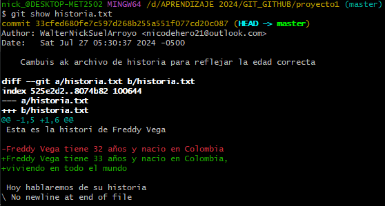

Si hacemos modificaciones nuevamente, le damos git add, y le damos commit sin ningun mensaje nos saldra la siguiente pantalla: 

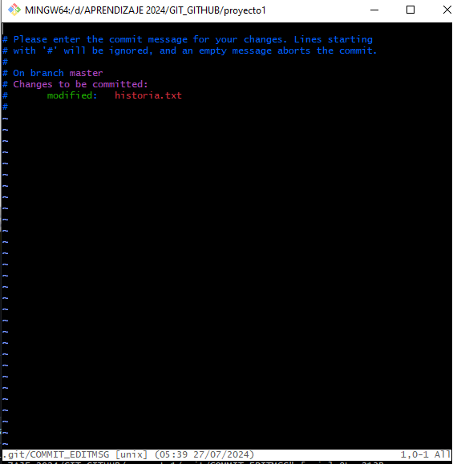

Entonces escribimos el mensaje y para salir de esa ventana tenemos que hacer: Esc + shift +zz

El comando **git diff** muestra las diferencias entre dos versiones de archivos en el repositorio. Por defecto, compara los cambios en tu directorio de trabajo con el área de preparación (staging area), mostrando las diferencias entre los archivos modificados y su versión en el área de preparación.

Para ver diferencias entre dos commits específicos:
**git diff commit1 commit2**

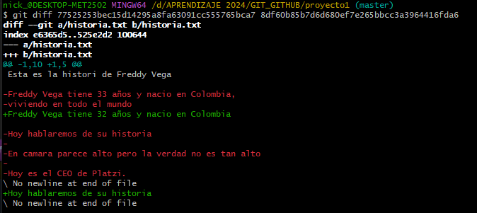

Cuando usas git diff en general, puedes poner el commit más antiguo primero para ver los cambios incrementales hacia el commit más reciente. Esto hace que sea más fácil ver cómo ha evolucionado el código con el tiempo.

## 10. ¿Que es el staging?

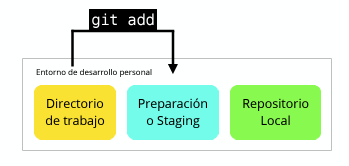

La imagen representa el proceso de usar el comando git add en Git, mostrando el flujo de archivos desde el "Directorio de trabajo" hasta el "Repositorio Local". Aquí, el entorno de desarrollo personal es donde los cambios en los archivos son realizados. Los archivos modificados se mueven al área de "Preparación" o "Staging" usando git add, donde se preparan para ser confirmados en el repositorio local.

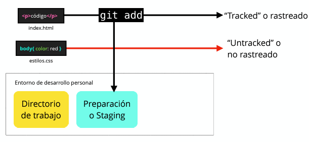

La imagen ilustra específicamente cómo el comando git add afecta a los archivos individuales dentro de un proyecto Git, utilizando index.html y estilos.css como ejemplos. index.html ha sido agregado al área de staging y está listo para ser confirmado, mientras que estilos.css aparece como "Untracked", indicando que aún no ha sido preparado para el próximo commit. Esta imagen destaca la funcionalidad selectiva de Git, permitiendo a los desarrolladores escoger exactamente qué cambios incluir en un commit, asegurando así una mayor precisión y control sobre la versión final del código.

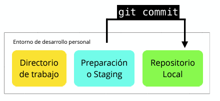

La imagen muestra el uso del comando git commit en un entorno de desarrollo personal, ilustrando cómo se mueven los cambios del área de "Preparación o Staging" al "Repositorio Local". Este proceso se realiza después de haber agregado los cambios deseados al área de staging con git add. El comando git commit captura una instantánea de los cambios en staging, creando un nuevo commit en el repositorio local. Este paso es crucial porque registra oficialmente los cambios en la historia del proyecto, permitiendo que el estado actual de estos archivos pueda ser revisado o restaurado en cualquier momento.

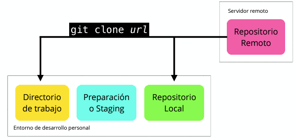

La imagen explica el uso del comando git clone seguido de una URL, que es el método para copiar un repositorio remoto en un servidor a un repositorio local en el entorno de desarrollo personal del usuario. El proceso comienza con el comando git clone, que no solo descarga el contenido del repositorio remoto sino que también establece una conexión entre el repositorio local y el remoto, permitiendo futuras actualizaciones y sincronizaciones. El repositorio local que se crea incluye todos los archivos del proyecto, así como el área de preparación o staging, listo para que se trabajen los cambios. Este comando es fundamental para iniciar un proyecto en un nuevo entorno de desarrollo o para colaborar en proyectos con otros desarrolladores.

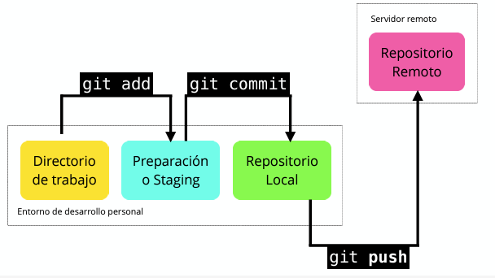

Esta imagen ofrece una visión completa del flujo de trabajo típico en Git que incluye los comandos git add, git commit y git push. Comienza con la adición de cambios al área de preparación o staging desde el directorio de trabajo mediante git add. Después, los cambios son confirmados en el repositorio local usando git commit. Finalmente, git push se utiliza para enviar estos cambios confirmados desde el repositorio local al repositorio remoto alojado en un servidor. Este paso es crucial para compartir los cambios con otros colaboradores y para mantener un registro centralizado de todas las modificaciones en el proyecto.

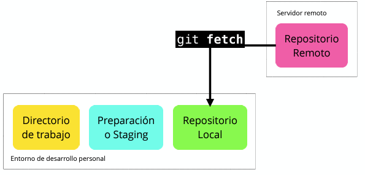

La imagen ilustra el comando git fetch, que es esencial para sincronizar el repositorio local con el repositorio remoto. Al ejecutar git fetch, Git recupera todas las actualizaciones del repositorio remoto (como nuevos commits, ramas, y otros cambios) que aún no existen en el repositorio local. Sin embargo, este comando no fusiona los cambios en el directorio de trabajo ni modifica el estado actual de los archivos desarrollados localmente, lo que permite al desarrollador revisar estos cambios antes de decidir integrarlos, típicamente usando git merge o git rebase.

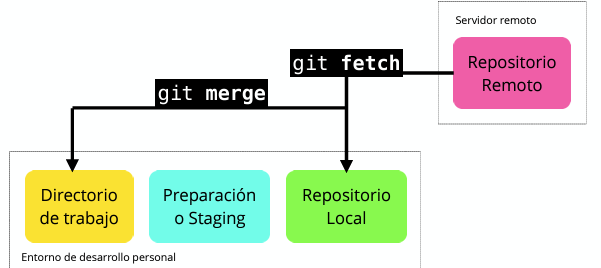

Esta imagen describe el proceso combinado de usar git fetch seguido de git merge en un flujo de trabajo de Git. Al ejecutar git fetch, el repositorio local se actualiza con la información del repositorio remoto sin modificar el directorio de trabajo actual. Esto trae todas las ramas y cambios recientes al repositorio local, pero mantiene los cambios locales sin fusionar. Después de revisar estos cambios, se utiliza git merge para combinar los cambios del repositorio remoto con la rama actual en el directorio de trabajo. Este proceso es crucial para mantener sincronizado el desarrollo local con las actualizaciones que pueden haber sido realizadas por otros colaboradores en el repositorio remoto.

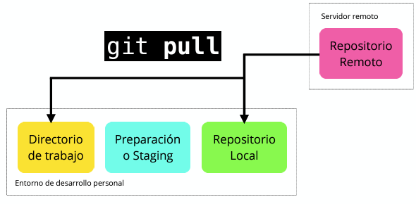

La imagen ilustra el comando git pull, que es esencialmente un atajo para ejecutar git fetch seguido de git merge. Cuando se ejecuta git pull, Git automáticamente recupera los cambios del repositorio remoto (como lo haría git fetch) y luego inmediatamente realiza un git merge para combinar esos cambios en la rama local del directorio de trabajo. Este comando es muy utilizado para mantener actualizado el repositorio local con el remoto de manera eficiente y rápida, reduciendo el esfuerzo y simplificando el proceso de actualizar y sincronizar cambios.

## 11. ¿Que es branch (rama) y cómo funciona un Merge en Git?

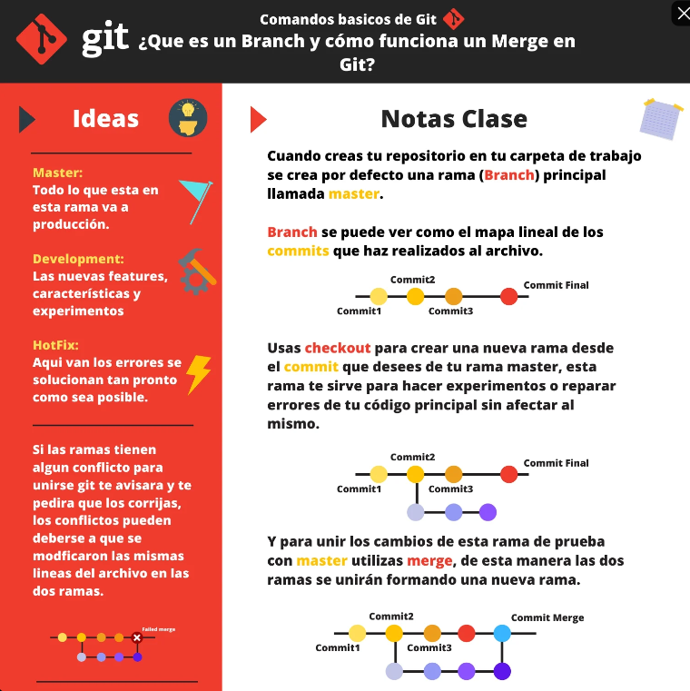

## 12. Volver en el tiempo en nuestro repositorio utilizando reset y checkout

El comando git reset se utiliza para deshacer cambios en el área de preparación (staging area) y/o en el directorio de trabajo. Dependiendo de cómo lo uses, puede tener diferentes efectos:

git reset (sin opciones): Deshace los cambios en el área de preparación, moviendo los archivos desde el área de preparación al directorio de trabajo. Los cambios permanecen en el directorio de trabajo, pero ya no están listos para ser confirmados.

git reset --soft commit: Mueve el puntero del HEAD a commit, manteniendo los cambios en el área de preparación. Es útil si quieres deshacer un commit pero mantener los cambios para hacer modificaciones antes de un nuevo commit.

git reset --mixed commit: Mueve el puntero del HEAD a commit, deshaciendo los cambios en el área de preparación, pero manteniéndolos en el directorio de trabajo. Es útil para deshacer cambios preparados pero mantenerlos en el directorio de trabajo.

git reset --hard commit: Mueve el puntero del HEAD a commit, y elimina todos los cambios en el área de preparación y el directorio de trabajo. Los archivos en el directorio de trabajo se revertirán a su estado en commit. Usa esto con precaución, ya que los cambios no guardados se perderán.

El comando git checkout se utiliza para cambiar de rama o para revisar una versión específica de un archivo en tu repositorio. 

git checkout 8df60b85b7d6d680ef7e265bbcc3a3964416fda6 historia.txt

El comando git checkout en este contexto hará que historia.txt se actualice al estado en el que se encontraba en el commit con el hash 8df60b85b7d6d680ef7e265bbcc3a3964416fda6, pero solo para ese archivo. El archivo historia.txt se actualizará en tu directorio de trabajo para coincidir con su versión en el commit especificado.
Los cambios en historia.txt en tu directorio de trabajo que no han sido confirmados se sobrescribirán, así que asegúrate de guardar cualquier cambio importante antes de ejecutar este comando.

Si has actualizado historia.txt a una versión específica y ahora deseas restaurar la versión más reciente de master, puedes hacerlo con el siguiente comando:

git checkout master -- historia.txt

Este comando realiza lo siguiente:

master: Especifica la rama desde la cual deseas restaurar el archivo.
-- historia.txt: Indica que solo deseas restaurar historia.txt a su versión en la rama master, sin cambiar de rama.

## 13. Git reset vs. Git rm

Aunque git reset y git rm se utilizan en diferentes contextos, pueden causar confusión porque ambos afectan el área de preparación y el directorio de trabajo, pero lo hacen de maneras distintas.

**1. git reset**

**Propósito:**

Principalmente se utiliza para deshacer cambios en el área de preparación y/o en el directorio de trabajo. Cambia el puntero del HEAD a un commit específico y puede afectar los cambios en el área de preparación y el directorio de trabajo.

Uso común:

- git reset: Deshace cambios en el área de preparación pero mantiene los cambios en el directorio de trabajo.
- git reset --soft commit: Deshace commits anteriores pero mantiene los cambios en el área de preparación.
- git reset --mixed commit: Deshace commits y elimina los cambios del área de preparación, pero mantiene los cambios en el directorio de trabajo.
- git reset --hard commit: Deshace commits y elimina todos los cambios en el área de preparación y el directorio de trabajo.

Ejemplo: Si has añadido archivos al área de preparación pero decides que no quieres confirmar esos cambios aún, usarías git reset para sacarlos del área de preparación, pero mantener los archivos modificados en tu directorio de trabajo.

**2. git rm**

**Propósito:** 

Se utiliza para eliminar archivos del directorio de trabajo y del área de preparación. También prepara la eliminación del archivo para el próximo commit.

Uso común:

- git rm archivo: Elimina el archivo del directorio de trabajo y del área de preparación, preparando el cambio para el próximo commit.
- git rm --cached archivo: Elimina el archivo del área de preparación pero lo mantiene en el directorio de trabajo (útil si deseas dejar de rastrear un archivo sin eliminarlo).

Ejemplo: Si decides que ya no quieres un archivo en tu proyecto, usarías git rm archivo para eliminar el archivo y registrar esta eliminación en el próximo commit.

**Resumen de Diferencias**

- git reset: Afecta cómo se manejan los cambios en el área de preparación y el directorio de trabajo. No elimina archivos, solo cambia su estado en el contexto de preparación y commits.

- git rm: Elimina archivos del directorio de trabajo y el área de preparación. Es un comando para manejar archivos en el proyecto, no para ajustar el estado de preparación o los commits.

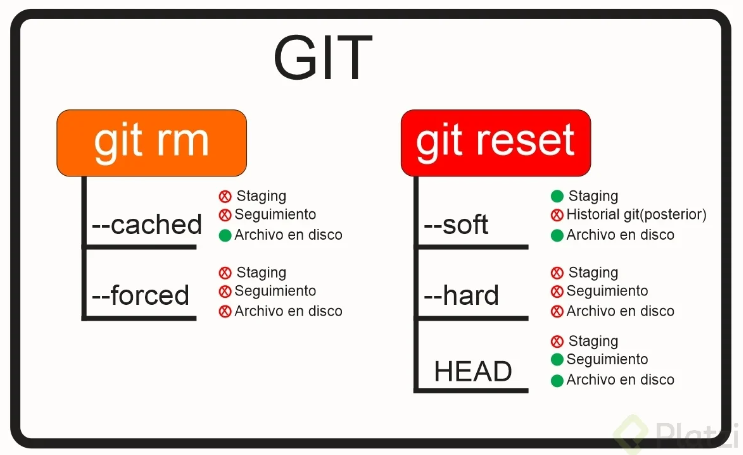