# SECCION 2. COMANDOS BÁSICOS EN GIT

## 8. ¿Qué es staging, repositorios y cuál es el ciclo básico de trabajo en GitHub

Usamos el comando **git init** para inicializar un nuevo repositorio Git vacío en el directorio actual. Crea una carpeta oculta llamada .git donde Git almacena toda la información del repositorio.
A partir de ello podemos avanzar con nuestro proyecto y para ver el estado usamos: 

Con **git status** se muestra el estado actual del repositorio, incluyendo archivos modificados, archivos en el área de preparación (staging area) y archivos no rastreados.

Con **git add historia.txt** se añade el archivo historia.txt al área de preparación, preparándolo para ser confirmado en el próximo commit.

Con el comando **git rm historia.txt** elimina el archivo historia.txt del directorio de trabajo y del área de preparación, y prepara el cambio para ser confirmado en el próximo commit.

Al usar git rm puede que nos salga un error: Este error indica que historia.txt tiene cambios que ya están en el área de preparación. Esto se puede resolver de la siguiente manera:

Para eliminar el archivo solo del área de preparación, pero mantenerlo en el directorio de trabajo: Usa la opción --cached.

**git rm --cached historia.txt**

El comando **git commit** guarda los cambios en el área de preparación (staging area) en el historial del repositorio. Crea un nuevo "commit" con un mensaje descriptivo que explica los cambios realizados.

**git commit -m "Añadido archivo de historial"**

Para ver el nombre y el correo electrónico registrados en tu configuración de Git, usa los siguientes comandos:

git config user.name
git config user.email

Para cambiar el nombre de usuario para el repositorio actual:
git config user.name "Nuevo Nombre"

Para cambiar el correo electrónico para el repositorio actual:
git config user.email "nuevoemail@example.com"

Para tener configuracion global que se aplique a todos los repositorios simplemente usarias el --global

git config --global user.name "Nuevo Nombre"
git config --global user.email "nuevoemail@example.com"

Si ya hemos hecho un commit y queremos modificar nuevamente nuestro archivo entonces tendremos que usar nuevamente git add y luego recien volver a realizar un commit.

El comando **git log historia.txt** muestra el historial de commits que han afectado al archivo historia.txt. Específicamente, te proporciona una lista de los commits en los que este archivo ha sido modificado, junto con detalles como el identificador del commit, el autor, la fecha y el mensaje del commit.

Este comando es útil para ver cómo ha cambiado un archivo a lo largo del tiempo y qué cambios se han realizado en él en cada commit.

**Resumen de la clase**

Esta clase explica el corazón de Git: el ciclo de vida de un archivo. Para no perder tu código ni el de tu equipo, debes entender que Git no guarda las cosas directamente. Divide el flujo en tres zonas: tu directorio de trabajo (tu carpeta normal), el Staging Area (una sala de espera temporal en la memoria RAM) y el Repositorio (la base de datos final guardada en la carpeta oculta .git).

El video también adelanta el concepto de ramas (branches), que sirven para dividir un proyecto en diferentes líneas de tiempo para que varias personas trabajen a la vez sin interferir entre sí.

**1. Los Estados de un Archivo**

Antes de ejecutar comandos, debes saber cómo ve Git tus archivos:

    - Untracked (Sin rastrear): Creaste un archivo, pero Git lo ignora. Aún no existe en su radar.
    - Tracked (Rastreado): Git ya sabe que el archivo existe y vigila sus cambios.
    - Modificado: Editaste un archivo rastreado, pero aún no preparas esos cambios para guardarlos.

**2. El Flujo de Trabajo Real (El viaje del código)**

El inicio (git init): Al ejecutar esto, enciendes Git. Se crea la carpeta oculta .git (tu repositorio real) y se habilita el área temporal de Staging.

A la sala de espera (git add): Cuando usas este comando, pasas los archivos modificados al Staging Area. Están listos y empaquetados en la RAM, pero aún no se han guardado permanentemente.

El guardado final (git commit -m "mensaje"): Toma todo lo que estaba esperando en Staging y lo inyecta al Repositorio (a la línea de tiempo principal llamada master). Al hacerlo, Git le asigna a esa versión un código único (hash, ej. ab32...) para identificar ese cambio exacto en la historia.

**3. Traer cambios a tu computadora (git checkout)**

El flujo no es solo de ida, también es de vuelta. Si alguien de tu equipo hace un cambio y lo sube, o si quieres volver a una versión del pasado, usas git checkout. Este comando saca la información del Repositorio y reescribe los archivos en tu carpeta visible para que puedas seguir trabajando sobre ellos.

**4. El poder de las Ramas (Branches)**

Imagina que estás construyendo una página web. Usando ramas, puedes tener el código principal a salvo en master, mientras creas una rama secundaria para rediseñar el menú y otra rama para cambiar los colores. Son entornos aislados. Cuando ambos experimentos estén listos y funcionando perfectamente, los fusionas con el código principal.

**¿Qué es git pull?**

Imagina que tú y tu compañero de equipo están trabajando en el mismo proyecto, pero él subió cambios nuevos al servidor de GitHub (por ejemplo, agregó un nuevo archivo para el portafolio en tu blog).

git pull es el comando que usas para decirle a tu Git local: "Oye, conéctate a internet (al repositorio remoto en GitHub), revisa si hay código nuevo, descárgalo y mézclalo inmediatamente con mi código local para que yo esté actualizado".

Técnicamente, git pull hace dos cosas de un solo golpe:
    - Descarga (Fetch): Trae la información nueva del servidor.
    - Fusiona (Merge): Mezcla automáticamente esa información nueva con la carpeta donde estás trabajando actualmente.

**Diferencias entre git pull y git checkout**

Ambos traen cosas, pero lo hacen de maneras completamente distintas:

| Característica | git pull | git checkout |
| :--- | :--- | :--- |
| ¿De dónde trae la información? | Del servidor remoto (internet, como GitHub). | De tu propio repositorio local (tu carpeta oculta .git). |
| ¿Para qué sirve principalmente? | Para actualizar tu computadora con el trabajo que hicieron otros en la nube. | Para viajar en el tiempo a versiones anteriores de tu propio código, o para cambiarte de una rama a otra. |
| ¿Modifica cosas nuevas? | Sí, descarga e inyecta código nuevo que tú no tenías. | No descarga nada de internet; solo cambia la vista de los archivos que ya tienes guardados localmente. |

Un ejemplo:

Usas git pull el lunes por la mañana para obtener el trabajo que tu equipo hizo el fin de semana.

Usas git checkout si arruinaste tu archivo historia.txt y quieres volver a la versión segura que tenías guardada ayer.

**¿Qué es main y cuál es la diferencia con master?**

Aquí tienes un dato histórico clave. Cuando instalas Git y haces git init, se crea automáticamente una rama principal. Esta rama es el pilar central de tu proyecto, la versión oficial de tu código.

Técnicamente: No hay ninguna diferencia. Ambos son simplemente nombres para la rama principal por defecto de tu proyecto. Funcionan exactamente igual.

Históricamente: Durante muchos años, el nombre por defecto que Git le daba a esta rama era master (y el video que estás viendo aún utiliza ese término). Sin embargo, alrededor del año 2020, la industria tecnológica decidió cambiar los estándares de nomenclatura por cuestiones de inclusión y comenzó a usar la palabra main (principal).

En la práctica: Hoy en día, si creas un repositorio nuevo directamente en la página web de GitHub, la rama principal se llamará main. Si lo creas localmente con versiones antiguas de Git, podría llamarse master. Puedes renombrarla si lo deseas, pero lo importante es entender que ambas palabras representan "la línea de tiempo principal y definitiva de tu proyecto".

## 9. ¿Que es un Branch (rama) y como funciona un Merge en Git?

Esta clase introduce el concepto más poderoso de Git: las ramas (branches). Las ramas te permiten crear "universos paralelos" o líneas de tiempo alternativas en tu proyecto.

En lugar de trabajar todo de forma lineal y arriesgarte a romper tu código principal, puedes separar tu trabajo. El video explica cómo aislar experimentos (nuevas características) o soluciones de emergencia (bugs) en sus propias ramas, para finalmente unir todo el trabajo funcional de vuelta a la línea principal a través de un proceso llamado Merge (fusión).

Para entender cómo se trabaja realmente en un entorno profesional, aquí están los conceptos clave desglosados de forma directa:

**1. La línea de tiempo principal (master o main)**

Es la columna vertebral de tu proyecto. Cada vez que haces un commit aquí, estás creando una versión oficial (v1, v2, v3). En la industria, el código que vive en esta rama es el que debe estar siempre estable y funcional, listo para que lo vean los usuarios.

**2. Ramas (Branches): Entornos de aislamiento**

Cuando quieres probar algo nuevo (como cambiar una librería), no lo haces en la rama principal. Creas una copia exacta del código en ese momento y le pones un nombre (ej. experimentos).

¿La ventaja? Puedes hacer decenas de commits (versiones) en esta rama. Si el experimento fracasa y arruina el código, no importa; tu rama principal sigue intacta.

**3. El estándar de la industria (Development y Hotfix)**

El video menciona nombres técnicos que vas a usar todos los días:

Development (Desarrollo): Es el nombre profesional para esa rama de "experimentos". Aquí es donde se construyen las nuevas funciones con calma.

Hotfix (Arreglo en caliente): Si de repente descubres un error crítico en tu página web que está en vivo, no puedes esperar a terminar la rama de desarrollo. Creas una rama rápida llamada hotfix directo desde la principal, solucionas el error, lo guardas y lo devuelves inmediatamente a la línea principal.

**4. Uniendo las líneas de tiempo (Merge) y HEAD**

Cuando terminas tu trabajo en una rama paralela (ya sea un hotfix o development), necesitas integrarlo al código oficial. Ese proceso de fusión se llama Merge.

HEAD: Es simplemente un indicador interno de Git que señala cuál es la versión final actual en la que estás posicionado en este momento.

**5. La realidad de los Conflictos**

Git es inteligente y suele fusionar archivos automáticamente. Pero, si en la rama de hotfix cambiaste la línea 10 de un archivo, y en la rama de development también cambiaste esa misma línea 10 de forma distinta, Git no sabrá cuál versión elegir cuando intentes hacer el merge. A esto se le llama Conflicto, y requerirá intervención humana para decidir qué código se queda y cuál se borra.

## 10. Crea un repositorio de Git y haz tu primer commit

Vamos a dividir las acciones de esta clase en pasos claros para que entiendas la lógica detrás de cada comando que debes ejecutar.

**1. Encendiendo Git (git init)**

Empiezas en una carpeta vacía (proyecto1). Al escribir git init, activas Git. Aunque no veas nada, si usas ls -al, verás que se creó una carpeta oculta llamada .git. Nunca debes entrar ni modificar los archivos de esta carpeta manualmente, es el "cerebro" donde Git guarda todo el historial.

**2. Creando el archivo y revisando el estado**

Abres tu editor (VS Code usando el comando code) y creas el archivo historia.txt.

Aquí entra en juego tu mejor amigo: git status. Este comando no altera nada, solo te da un diagnóstico. Al usarlo por primera vez, Git te dirá que hay un archivo nuevo pero que está en rojo (Untracked), es decir, Git lo está ignorando.

**3. Preparando los cambios (git add)**

Para que Git le preste atención, usas git add historia.txt.

Si vuelves a usar git status, verás el archivo en verde. Esto significa que está en el Staging Area (memoria RAM), listo para ser guardado.

¿Y si me equivoco? El video muestra cómo deshacer el add si subiste un archivo por accidente: git rm --cached historia.txt. Esto saca el archivo del Staging Area pero no borra el archivo de tu computadora.

**4. Configurando tu identidad (git config)**

Antes de hacer tu primer guardado oficial (commit), Git necesita saber quién eres, para que el historial tenga autores reales. Solo tienes que hacer esto una vez en tu computadora:

git config --global user.name "Tu Nombre"

git config --global user.email "tu@correo.com"

**5. El primer guardado oficial (git commit)**

Ahora sí, ejecutas git commit -m "Este es el primer commit de este archivo".

Tu archivo ha pasado oficialmente a la base de datos de Git.

**6. El ciclo se repite: Editando el archivo**

Modificas el texto en VS Code y lo guardas.

Si usas git status, te dirá que el archivo ha sido "modificado".

Si intentas hacer commit directamente, fallará. Recuerda la regla de oro: Git no guarda nada automáticamente. Todo cambio nuevo debe pasar primero por la sala de espera.

El atajo: En lugar de escribir el nombre del archivo, usas git add . (el punto significa "agrega todos los archivos modificados de esta carpeta").

Finalmente, haces un nuevo commit: git commit -m "Cambios para reflejar la edad correcta".

**7. Viendo el pasado (git log)**

Al usar git log historia.txt, puedes ver el historial cronológico de ese archivo. Verás los dos commits que hiciste, cada uno con su autor, fecha, el mensaje que escribiste, y un código largo (hash) que funciona como la "matrícula" única de esa versión exacta.

## 11. Analizar cambios en los archivos de tu proyecto con Git

El comando **git show historia.txt** muestra el contenido del archivo historia.txt tal como estaba en el último commit.

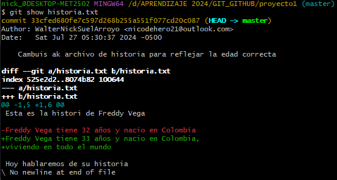

Si hacemos modificaciones nuevamente, le damos git add, y le damos commit sin ningun mensaje nos saldra la siguiente pantalla: 

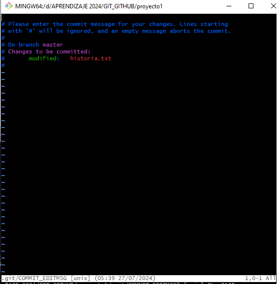

Entonces escribimos el mensaje y para salir de esa ventana tenemos que hacer: Esc + shift +zz

El comando **git diff** muestra las diferencias entre dos versiones de archivos en el repositorio. Por defecto, compara los cambios en tu directorio de trabajo con el área de preparación (staging area), mostrando las diferencias entre los archivos modificados y su versión en el área de preparación.

Para ver diferencias entre dos commits específicos:
**git diff commit1 commit2**

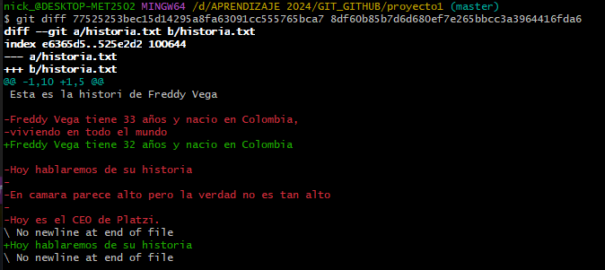

Cuando usas git diff en general, puedes poner el commit más antiguo primero para ver los cambios incrementales hacia el commit más reciente. Esto hace que sea más fácil ver cómo ha evolucionado el código con el tiempo.

**Resumen de la clase**

Esta clase se enfoca en cómo Git te permite auditar y rastrear la historia de tu código. Aprenderás a usar herramientas para ver exactamente qué líneas se añadieron o borraron en un archivo.

Además, se aborda una situación muy común: olvidar ponerle un mensaje a tu commit. Cuando esto pasa, Git te lanza a Vim, un editor de texto súper antiguo y confuso que vive dentro de la terminal. El video te enseña cómo sobrevivir a Vim, escribir tu mensaje y salir de ahí sin entrar en pánico.

**1. Radiografía del último cambio (git show)**

Cuando ejecutas git show historia.txt, Git te muestra el último commit que hiciste.

No solo te dice quién lo hizo y cuándo, sino que te hace un Diff (una diferencia). Usando colores (verde para lo añadido, rojo para lo eliminado) y símbolos (+ y -), te muestra exactamente qué líneas de texto fueron alteradas respecto a la versión anterior.

**2. El accidente del "Commit sin mensaje" (Sobreviviendo a Vim)**

Normalmente haces git commit -m "mensaje". Pero si accidentalmente escribes solo git commit y das Enter, Git abre automáticamente un editor llamado Vim para obligarte a escribir el mensaje.

¿Qué es Vim? Es un editor sin interfaz gráfica donde el ratón no funciona.

Cómo usarlo para tu mensaje:

Presiona la tecla i (Insertar). Ahora puedes escribir normalmente.

Escribe tu mensaje (las líneas que empiezan con # son ignoradas por Git).

Presiona la tecla Esc (Escape) para salir del modo de escritura.

Para guardar y forzar el cierre, presiona Shift + Z + Z (escribir dos zetas mayúsculas).
(Nota: Otra forma clásica de salir y guardar en Vim es escribiendo :wq y dando Enter).

**3. Comparando versiones específicas (git diff)**

Si git show te muestra el último cambio, git diff te permite comparar cualquier versión de la historia.

Primero usas git log historia.txt para ver la lista de tus commits y copias los códigos alfanuméricos largos (los hashes).

Luego escribes git diff [codigo_version_vieja] [codigo_version_nueva].

Importante: El orden importa. Si pones la versión vieja primero, Git te mostrará de forma lógica qué se añadió y qué se borró para llegar a la versión nueva (como leer un libro de izquierda a derecha). Si los pones al revés, Git te mostrará qué tendrías que deshacer para volver a la versión vieja.

Con estas herramientas (show, log y diff), nunca volverás a decir "no sé qué pasó, ayer funcionaba". Tienes el control total para rastrear dónde y cuándo se introdujo un cambio.

## 12. Volver en el tiempo en nuestro repositorio utilizando reset y checkout

El comando git reset se utiliza para deshacer cambios en el área de preparación (staging area) y/o en el directorio de trabajo. Dependiendo de cómo lo uses, puede tener diferentes efectos:

git reset (sin opciones): Deshace los cambios en el área de preparación, moviendo los archivos desde el área de preparación al directorio de trabajo. Los cambios permanecen en el directorio de trabajo, pero ya no están listos para ser confirmados.

git reset --soft commit: Mueve el puntero del HEAD a commit, manteniendo los cambios en el área de preparación. Es útil si quieres deshacer un commit pero mantener los cambios para hacer modificaciones antes de un nuevo commit.

git reset --mixed commit: Mueve el puntero del HEAD a commit, deshaciendo los cambios en el área de preparación, pero manteniéndolos en el directorio de trabajo. Es útil para deshacer cambios preparados pero mantenerlos en el directorio de trabajo.

git reset --hard commit: Mueve el puntero del HEAD a commit, y elimina todos los cambios en el área de preparación y el directorio de trabajo. Los archivos en el directorio de trabajo se revertirán a su estado en commit. Usa esto con precaución, ya que los cambios no guardados se perderán.

El comando git checkout se utiliza para cambiar de rama o para revisar una versión específica de un archivo en tu repositorio. 

git checkout 8df60b85b7d6d680ef7e265bbcc3a3964416fda6 historia.txt

El comando git checkout en este contexto hará que historia.txt se actualice al estado en el que se encontraba en el commit con el hash 8df60b85b7d6d680ef7e265bbcc3a3964416fda6, pero solo para ese archivo. El archivo historia.txt se actualizará en tu directorio de trabajo para coincidir con su versión en el commit especificado.
Los cambios en historia.txt en tu directorio de trabajo que no han sido confirmados se sobrescribirán, así que asegúrate de guardar cualquier cambio importante antes de ejecutar este comando.

Si has actualizado historia.txt a una versión específica y ahora deseas restaurar la versión más reciente de master, puedes hacerlo con el siguiente comando:

git checkout master -- historia.txt

Este comando realiza lo siguiente:

master: Especifica la rama desde la cual deseas restaurar el archivo.
-- historia.txt: Indica que solo deseas restaurar historia.txt a su versión en la rama master, sin cambiar de rama.

**Resumen de la clase**

Esta lección se centra en uno de los comandos más peligrosos y útiles de Git: git reset. Te permite "viajar en el tiempo" eliminando el historial reciente y devolviendo tu proyecto a un estado anterior exacto.

Además de explicar la diferencia entre un borrado "suave" (donde no pierdes tu trabajo pendiente) y uno "duro" (donde todo el trabajo reciente desaparece para siempre), la clase hace una práctica construyendo un pequeño proyecto web con HTML y CSS. Esto demuestra cómo Git maneja múltiples archivos y carpetas nuevas al mismo tiempo, y cómo puedes ver las diferencias entre lo que estás escribiendo ahora mismo y lo que acabas de enviar a la "sala de espera" (Staging).

**1. Viaje destructivo en el tiempo: git reset --hard**

¿Para qué sirve?: Imagina que hiciste dos commits horribles y rompiste tu código. Quieres deshacerlos como si nunca hubieran existido.

¿Cómo se hace?

Usas git log y copias el código (hash) del commit "bueno" al que quieres regresar.

Ejecutas git reset --hard [codigo_del_commit_bueno].

El resultado: Tu código vuelve a estar exactamente como estaba en ese momento. Los commits posteriores son borrados de la historia. Es un movimiento irreversible, así que debes estar 100% seguro de usar --hard.

**2. Viaje conservador en el tiempo: git reset --soft**

Funciona igual que el anterior, retrocediendo en el historial, pero no toca tus archivos locales ni tu Staging Area.

¿Para qué sirve?: Es útil si te arrepientes del mensaje de tu último commit o si decidiste que querías juntar los últimos dos commits en uno solo. Retrocedes en la historia oficial, pero tu código modificado sigue ahí, listo para que le hagas un nuevo commit correctamente.

**3. El superpoder de git diff sin argumentos**

En clases pasadas usaste git diff comparando dos códigos de commits. Pero si simplemente escribes git diff y das Enter, Git hace algo mágico:

Compara exactamente lo que tienes guardado en tu disco duro (Directorio de trabajo) versus lo que tienes preparado en la memoria RAM (Staging Area). Es la forma perfecta de preguntarle a Git: "¿Qué es exactamente lo que he modificado en el código en los últimos cinco minutos y que aún no le he dado git add?"

**4. Git y las carpetas**

Durante el ejemplo práctico, se creó una carpeta llamada CSS con un archivo adentro.

A Git realmente no le importan las carpetas vacías; solo rastrea archivos. Si agregas todo con git add ., Git detectará el archivo nuevo y guardará la ruta (css/estilos.css) sin problemas.

**5. Un historial más detallado: git log --stat**

Mientras que git log normal te dice quién y cuándo hizo un cambio, si le agregas --stat, te dará estadísticas rápidas. Te dirá qué archivos específicos se modificaron en ese commit y cuántas líneas (o bytes) se añadieron o borraron en cada uno, dándote un resumen perfecto de la "magnitud" de cada cambio.

## ¿Que es el staging?

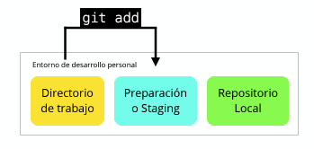

La imagen representa el proceso de usar el comando git add en Git, mostrando el flujo de archivos desde el "Directorio de trabajo" hasta el "Repositorio Local". Aquí, el entorno de desarrollo personal es donde los cambios en los archivos son realizados. Los archivos modificados se mueven al área de "Preparación" o "Staging" usando git add, donde se preparan para ser confirmados en el repositorio local.

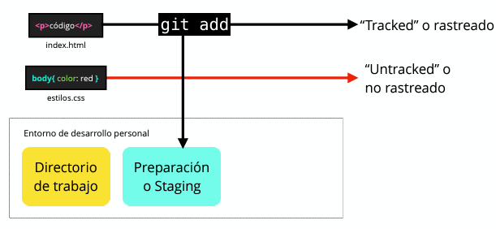

La imagen ilustra específicamente cómo el comando git add afecta a los archivos individuales dentro de un proyecto Git, utilizando index.html y estilos.css como ejemplos. index.html ha sido agregado al área de staging y está listo para ser confirmado, mientras que estilos.css aparece como "Untracked", indicando que aún no ha sido preparado para el próximo commit. Esta imagen destaca la funcionalidad selectiva de Git, permitiendo a los desarrolladores escoger exactamente qué cambios incluir en un commit, asegurando así una mayor precisión y control sobre la versión final del código.

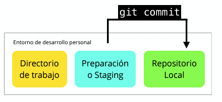

La imagen muestra el uso del comando git commit en un entorno de desarrollo personal, ilustrando cómo se mueven los cambios del área de "Preparación o Staging" al "Repositorio Local". Este proceso se realiza después de haber agregado los cambios deseados al área de staging con git add. El comando git commit captura una instantánea de los cambios en staging, creando un nuevo commit en el repositorio local. Este paso es crucial porque registra oficialmente los cambios en la historia del proyecto, permitiendo que el estado actual de estos archivos pueda ser revisado o restaurado en cualquier momento.

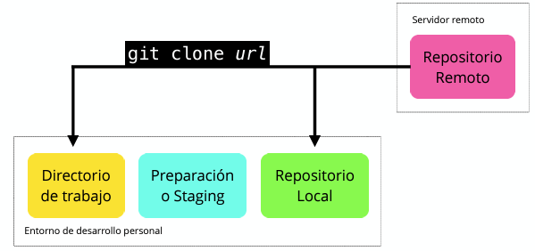

La imagen explica el uso del comando git clone seguido de una URL, que es el método para copiar un repositorio remoto en un servidor a un repositorio local en el entorno de desarrollo personal del usuario. El proceso comienza con el comando git clone, que no solo descarga el contenido del repositorio remoto sino que también establece una conexión entre el repositorio local y el remoto, permitiendo futuras actualizaciones y sincronizaciones. El repositorio local que se crea incluye todos los archivos del proyecto, así como el área de preparación o staging, listo para que se trabajen los cambios. Este comando es fundamental para iniciar un proyecto en un nuevo entorno de desarrollo o para colaborar en proyectos con otros desarrolladores.

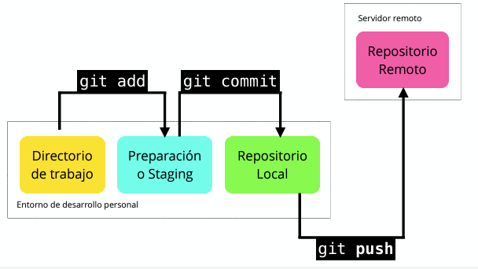

Esta imagen ofrece una visión completa del flujo de trabajo típico en Git que incluye los comandos git add, git commit y git push. Comienza con la adición de cambios al área de preparación o staging desde el directorio de trabajo mediante git add. Después, los cambios son confirmados en el repositorio local usando git commit. Finalmente, git push se utiliza para enviar estos cambios confirmados desde el repositorio local al repositorio remoto alojado en un servidor. Este paso es crucial para compartir los cambios con otros colaboradores y para mantener un registro centralizado de todas las modificaciones en el proyecto.

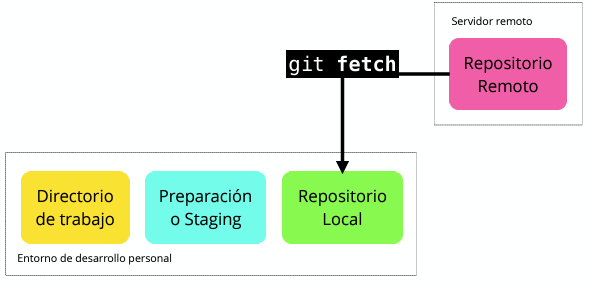

La imagen ilustra el comando git fetch, que es esencial para sincronizar el repositorio local con el repositorio remoto. Al ejecutar git fetch, Git recupera todas las actualizaciones del repositorio remoto (como nuevos commits, ramas, y otros cambios) que aún no existen en el repositorio local. Sin embargo, este comando no fusiona los cambios en el directorio de trabajo ni modifica el estado actual de los archivos desarrollados localmente, lo que permite al desarrollador revisar estos cambios antes de decidir integrarlos, típicamente usando git merge o git rebase.

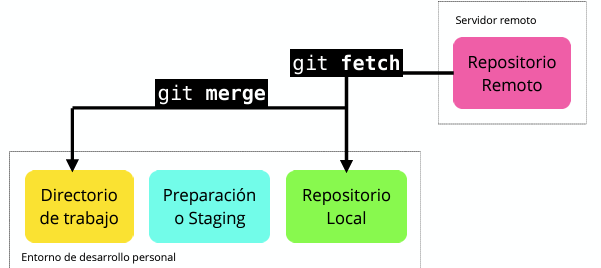

Esta imagen describe el proceso combinado de usar git fetch seguido de git merge en un flujo de trabajo de Git. Al ejecutar git fetch, el repositorio local se actualiza con la información del repositorio remoto sin modificar el directorio de trabajo actual. Esto trae todas las ramas y cambios recientes al repositorio local, pero mantiene los cambios locales sin fusionar. Después de revisar estos cambios, se utiliza git merge para combinar los cambios del repositorio remoto con la rama actual en el directorio de trabajo. Este proceso es crucial para mantener sincronizado el desarrollo local con las actualizaciones que pueden haber sido realizadas por otros colaboradores en el repositorio remoto.

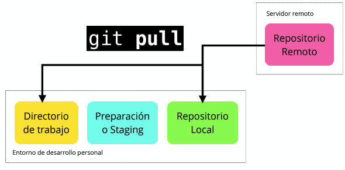

La imagen ilustra el comando git pull, que es esencialmente un atajo para ejecutar git fetch seguido de git merge. Cuando se ejecuta git pull, Git automáticamente recupera los cambios del repositorio remoto (como lo haría git fetch) y luego inmediatamente realiza un git merge para combinar esos cambios en la rama local del directorio de trabajo. Este comando es muy utilizado para mantener actualizado el repositorio local con el remoto de manera eficiente y rápida, reduciendo el esfuerzo y simplificando el proceso de actualizar y sincronizar cambios.

## ¿Que es branch (rama) y cómo funciona un Merge en Git?

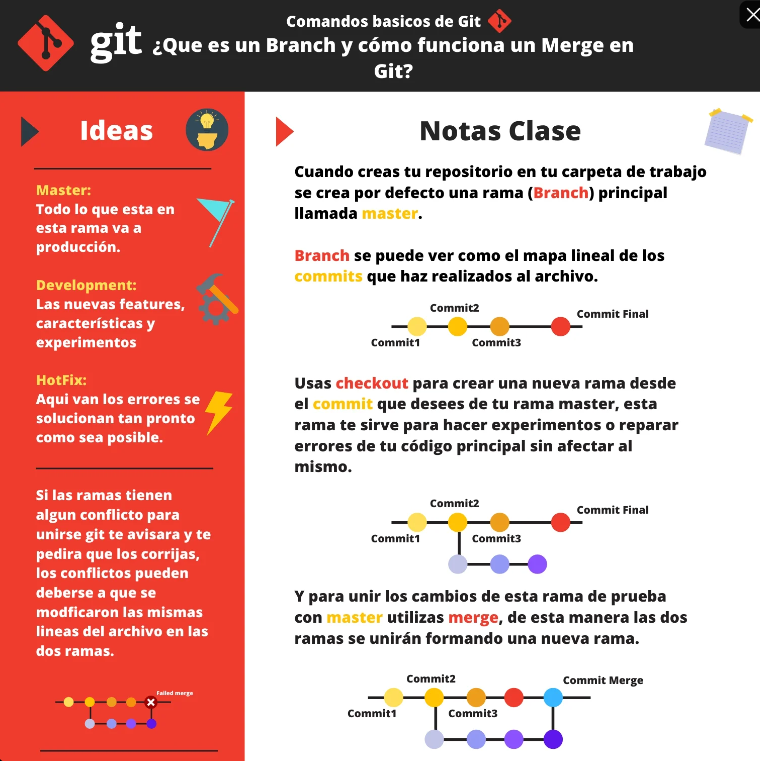

## Git reset vs. Git rm

Aunque git reset y git rm se utilizan en diferentes contextos, pueden causar confusión porque ambos afectan el área de preparación y el directorio de trabajo, pero lo hacen de maneras distintas.

**1. git reset**

**Propósito:**

Principalmente se utiliza para deshacer cambios en el área de preparación y/o en el directorio de trabajo. Cambia el puntero del HEAD a un commit específico y puede afectar los cambios en el área de preparación y el directorio de trabajo.

Uso común:

- git reset: Deshace cambios en el área de preparación pero mantiene los cambios en el directorio de trabajo.
- git reset --soft commit: Deshace commits anteriores pero mantiene los cambios en el área de preparación.
- git reset --mixed commit: Deshace commits y elimina los cambios del área de preparación, pero mantiene los cambios en el directorio de trabajo.
- git reset --hard commit: Deshace commits y elimina todos los cambios en el área de preparación y el directorio de trabajo.

Ejemplo: Si has añadido archivos al área de preparación pero decides que no quieres confirmar esos cambios aún, usarías git reset para sacarlos del área de preparación, pero mantener los archivos modificados en tu directorio de trabajo.

**2. git rm**

**Propósito:** 

Se utiliza para eliminar archivos del directorio de trabajo y del área de preparación. También prepara la eliminación del archivo para el próximo commit.

Uso común:

- git rm archivo: Elimina el archivo del directorio de trabajo y del área de preparación, preparando el cambio para el próximo commit.
- git rm --cached archivo: Elimina el archivo del área de preparación pero lo mantiene en el directorio de trabajo (útil si deseas dejar de rastrear un archivo sin eliminarlo).

Ejemplo: Si decides que ya no quieres un archivo en tu proyecto, usarías git rm archivo para eliminar el archivo y registrar esta eliminación en el próximo commit.

**Resumen de Diferencias**

- git reset: Afecta cómo se manejan los cambios en el área de preparación y el directorio de trabajo. No elimina archivos, solo cambia su estado en el contexto de preparación y commits.

- git rm: Elimina archivos del directorio de trabajo y el área de preparación. Es un comando para manejar archivos en el proyecto, no para ajustar el estado de preparación o los commits.

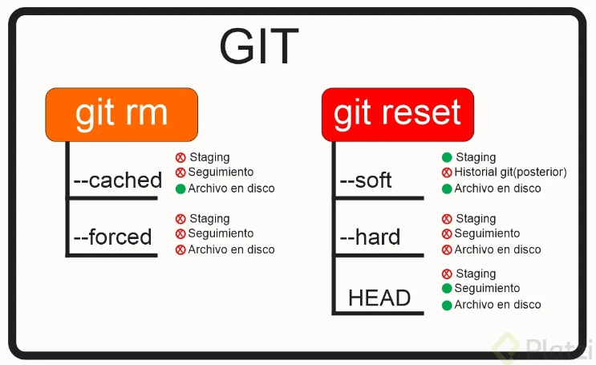