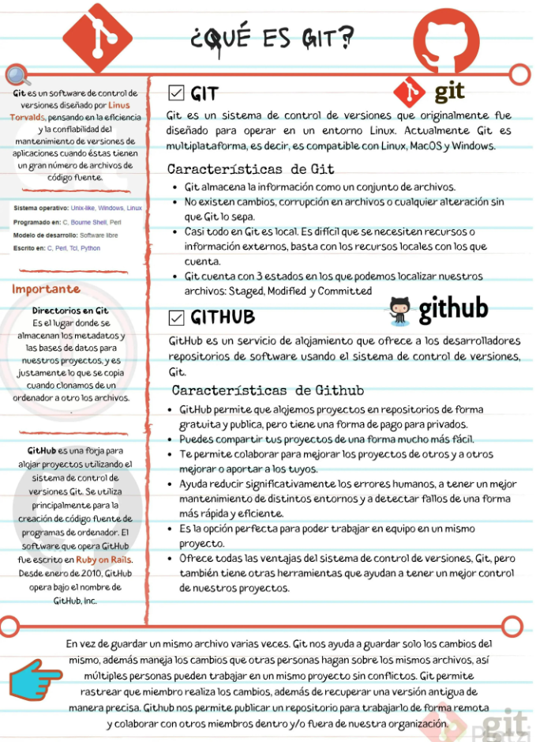
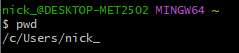
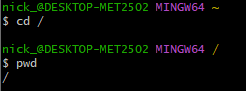
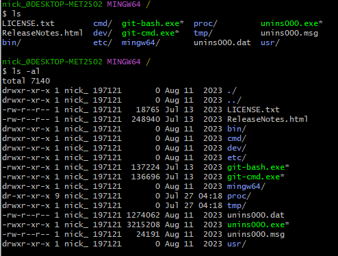
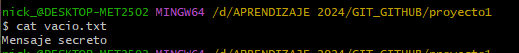

# SECCION 1. INTRODUCCIÓN A GIT

## 1. ¿Porque usar un sistema de control de versiones como Git?

Usar un sistema de control de versiones como Git tiene múltiples ventajas, especialmente en entornos de desarrollo colaborativo y dinámico. Aquí te detallo algunas razones clave para adoptarlo:

**1. Colaboración:**

Git facilita la colaboración entre múltiples desarrolladores. Permite que varios desarrolladores trabajen simultáneamente en el mismo proyecto sin interferir en el trabajo de los demás. Cada desarrollador trabaja en su propia "rama" y luego puede fusionar su trabajo con la rama principal o con las ramas de otros compañeros.

**2. Control de Versiones:**

Permite mantener un historial completo de todos los cambios realizados en el código. Cada cambio se guarda como un "commit" con una descripción asociada, lo que permite entender quién hizo qué cambios y por qué. Esto es crucial para rastrear el origen de los errores y entender la evolución del proyecto.

**3. Desarrollo Descentralizado:**

Git es un sistema distribuido, lo que significa que cada desarrollador tiene una copia completa del repositorio, incluyendo todo el historial de cambios. Esto permite trabajar de manera independiente y segura, sin necesidad de una conexión constante a un servidor central.

**4. Gestión de Ramas:**

Las ramas en Git permiten a los desarrolladores experimentar y desarrollar funcionalidades independientemente. Las ramas pueden ser creadas para diferentes características, versiones o para pruebas específicas, y pueden ser fusionadas cuando los cambios estén listos para ser integrados al proyecto principal.

**5. Respaldo y Restauración:**

Dado que cada clon del repositorio es una copia de seguridad completa, perder datos es mucho menos probable. Además, si algo sale mal, es fácil revertir a versiones anteriores de los archivos o incluso del proyecto completo.

**6. Integración con Herramientas de Desarrollo:**

Git se integra bien con numerosas plataformas de desarrollo, sistemas de integración continua/despliegue continuo (CI/CD), y herramientas de gestión de proyectos, lo que permite automatizar partes del flujo de trabajo de desarrollo y asegurar la calidad del software.

**7. Seguridad:**

Puedes configurar Git para trabajar con repositorios remotos a través de protocolos seguros como HTTPS o SSH. Además, Git permite controlar el acceso a diferentes partes del código a través de permisos, asegurando que solo las personas autorizadas puedan hacer cambios críticos.

**8. Acceso Offline:**

Como Git es un sistema distribuido, puedes continuar trabajando en tus archivos localmente, incluso sin acceso a internet. Esto es ideal para situaciones donde la conectividad es un problema o cuando se está en movimiento.

**9. Facilidad de Uso:**

A pesar de su potencia, Git es relativamente fácil de aprender, especialmente las operaciones básicas necesarias para el día a día de un desarrollador. Además, hay una amplia comunidad y muchos recursos de aprendizaje disponibles.

**10. Adopción Extendida:**

Git es el sistema de control de versiones más popular en la actualidad, utilizado por pequeñas startups hasta grandes corporaciones, así como en proyectos open source. Esto significa que hay una gran cantidad de herramientas compatibles y una comunidad activa para obtener soporte.

Estas características hacen de Git una herramienta indispensable para cualquier equipo de desarrollo moderno, optimizando y asegurando el proceso de desarrollo de software.

Archivosd de clase: https://static.platzi.com/media/public/uploads/git-github_917f1c24-de6d-4d30-99ca-f47214e6ae16.pdf

## 2. ¿Que es Git?

Git es un sistema de control de versiones distribuido que te permite registrar los cambios que haces en tus archivos y volver a versiones anteriores si algo sale mal. Fue diseñado por Linus Torvalds para garantizar la eficiencia y confiabilidad del mantenimiento de versiones de aplicaciones que tienen un gran número de archivos de código fuente.

- Git está optimizado para guardar cambios de forma incremental.
- Permite contar con un historial, regresar a una versión anterior y agregar funcionalidades.
- Lleva un registro de los cambios que otras personas realicen en los archivos.

Git fue diseñado para operar en un entorno Linux. Actualmente, es multiplataforma, es decir, es compatible con Linux, MacOS y Windows. En la máquina local se encuentra Git, se utiliza bajo la terminal o línea de comandos y tiene comandos como merge, pull, add, commit y rebase, entre otros.

**Para qué proyectos sirve Git**

Con Git se obtiene una mayor eficiencia usando archivos de texto plano, ya que con archivos binarios no puede guardar solo los cambios, sino que debe volver a grabar el archivo completo ante cada modificación, por mínima que sea, lo que hace que incremente demasiado el tamaño del repositorio.

“Guardar archivos binarios en el repositorio de Git no es una buena práctica, únicamente deberían guardarse archivos pequeños (como logos) que no sufran casi modificaciones durante la vida del proyecto. Los binarios deben guardarse en un CDN”.

**Características de Git**

Git te ayuda a trabajar de manera más organizada y colaborativa en proyectos de desarrollo de software. Estas son algunas de sus principales características:

**Control de versiones**

Git almacena la información como un conjunto de archivos. Te permite llevar un registro de los cambios que haces en tus archivos, lo que significa que siempre puedes volver a versiones anteriores si algo sale mal.

**Ramificación**

Puedes crear ramas en tu proyecto, lo que te permite trabajar en diferentes características o aspectos del mismo sin afectar el trabajo de los demás.

**Colaboración**

En Git, varias personas pueden trabajar en diferentes aspectos del proyecto al mismo tiempo.

**Seguridad**

No existen cambios, corrupción en archivos o cualquier alteración sin que Git lo sepa. Git cuenta con 3 estados en los que es posible localizar archivos: Staged, Modified y Committed.

**Flexibilidad**

Casi todo en Git es local. Es difícil que se necesiten recursos o información externos, basta con los recursos locales con los que cuenta.

**Comandos**

Git tiene una sintaxis de comandos bastante sencilla y fácil de aprender, lo que lo hace accesible incluso para principiantes en programación.

**¿Qué es un sistema de control de versiones?:** El SCV o VCS (por sus siglas en inglés) es un sistema que registra los cambios realizados sobre un archivo o conjunto de archivos a lo largo del tiempo, de modo que puedas llevar el historial del ciclo de vida de un proyecto, comparar cambios a lo largo del tiempo, ver quién los realizó o revertir el proyecto entero a un estado anterior.

Cualquier tipo de archivo que se encuentre en un ordenador puede ponerse bajo control de versiones.

**¿En qué se diferencia de Github?**: Github es una plataforma de desarrollo colaborativo para alojar proyectos utilizando el sistema de control de versiones Git. Se emplea principalmente para la creación de código fuente de programas de computadora.

Puede considerarse a Github como la red social de código para los programadores y en muchos casos es visto como un curriculum vitae, pues aquí se guarda el portafolio de proyectos de programación.

**Características de Github**

- GitHub permite alojar proyectos en repositorios de forma gratuita y pública, pero tiene una forma de pago para privados.

- Puedes compartir fácilmente tus proyectos.

- Permite colaborar para mejorar los proyectos de otros y a otros mejorar o aportar a los tuyos.

- Ayuda a reducir significativamente los errores humanos, a tener un mejor mantenimiento de distintos entornos y a detectar fallos de una forma más rápida y eficiente.

- Es la opción perfecta para poder trabajar en equipo en un mismo proyecto.

- Ofrece todas las ventajas del sistema de control de versiones Git, pero también tiene otras herramientas que ayudan a tener un mejor control de los proyectos.

## 3. Instalando GitBash en windows
## 4. Instalando Git en OSX
## 5. Instalando Git en Linux

## 6. Editores de código, archivos binarios y de texto plano

**Editores de Código**

Los editores de código son herramientas diseñadas específicamente para la escritura y edición de código fuente. Proporcionan características que facilitan el desarrollo de software, como resaltado de sintaxis, autocompletado, navegación de archivos, y depuración. Existen muchos editores de código, cada uno con sus propias características y ventajas.

**Archivos Binarios**

Los archivos binarios contienen datos en formato binario, es decir, secuencias de bits que no están directamente legibles por humanos. Los programas almacenan información en estos archivos para optimizar el almacenamiento y el rendimiento. Los archivos binarios pueden incluir cualquier tipo de datos, desde aplicaciones ejecutables hasta imágenes, audio, video, y archivos comprimidos.

**Archivos de Texto Plano**

Los archivos de texto plano contienen solo texto sin ningún formato especial o codificación binaria. Son legibles por humanos y se pueden abrir con cualquier editor de texto. Son ampliamente utilizados para documentos simples, scripts, configuraciones, y otros tipos de archivos donde la legibilidad es importante.

Los editores de código suelen trabajar con archivos de texto plano, ya que el código fuente es legible y manipulable. Los archivos binarios, por otro lado, requieren herramientas especializadas para su edición y comprensión.

## 7. Introduccion a la terminal y linea de comandos

**1. Comando pwd:** 

El comando pwd en la línea de comandos significa "print working directory" (imprimir directorio de trabajo). Se utiliza para mostrar la ruta completa del directorio en el que te encuentras actualmente. Por ejemplo, si estás en el directorio /home/usuario/proyectos, al ejecutar pwd se mostrará esa ruta completa. Es útil para verificar tu ubicación actual en el sistema de archivos.
Cuando abrimos git bash y ponemos pwd esta nos indicara la ubicacion por defecto del usuario 

**2. Comando cd:**

El comando cd (abreviatura de "change directory", cambiar de directorio) se utiliza en la línea de comandos para cambiar el directorio de trabajo actual. Al ejecutar cd, puedes navegar a diferentes directorios en tu sistema de archivos.

En Windows, el comando **cd /** funciona de manera similar a como lo hace en sistemas Unix/Linux, pero con algunas diferencias debido a la estructura de archivos de Windows.

En Windows, el sistema de archivos se organiza en unidades (como C:\, D:\, etc.) y cada unidad tiene su propio directorio raíz. Cuando ejecutas cd / en Windows, cambia el directorio actual al directorio raíz de la unidad actual. Por ejemplo:

Si estás en C:\Usuarios\TuNombre, ejecutar cd / te llevará a C:\.
Si estás en D:\Proyectos\MiProyecto, ejecutar cd / te llevará a D:\.
Es importante notar que, a diferencia de Unix/Linux, donde / siempre se refiere al directorio raíz del sistema completo, en Windows, el comando cd / se refiere al directorio raíz de la unidad de disco actual en la que estás trabajando.

**3. Comando ls    y    ls -al**

Se utiliza para listar archivos y directorios en el directorio actual o en un directorio específico.

El comando **ls -al** se usa para mostrar todos los archivos, incluidos los ocultos (que empiezan con un punto .), y proporciona un listado detallado de cada archivo o directorio.

**4. Comando clear**

Con este comando puedo limpiar la consola. Alternativamente tambien se puede usar **ctrl + L**

**5. Comando mkdir**

El comando mkdir en Git Bash (Windows) se utiliza para crear nuevos directorios. Su nombre es una abreviatura de "make directory" (hacer directorio).

**6. Comando touch**

Este comando es comúnmente usado para crear nuevos archivos o modificar la fecha y hora de última modificación de archivos existentes.

touch nombre_del_archivo.extension

**7. Comando cat**

Es una herramienta versátil que puede servir para leer archivos

cat archivo.txt  : Este comando mostrará el contenido de archivo.txt en la pantalla.

**8. Comando history**

El comando history en Git Bash (Windows) muestra una lista de los comandos que has ejecutado en la sesión actual de la terminal. Esto te permite revisar y reutilizar comandos anteriores sin tener que volver a escribirlos. Solo es escribir history sin esepecificar el archivo, tambien puedes personalizarlo limitando el numero de comando que quieras mostrar: history 10: Esto mostrará solo los últimos 10 comandos ejecutados.
Puedes reutilizar un comando del historial utilizando el número de la línea del comando. Por ejemplo: !4

**9. Comando rm**

El comando rm en Git Bash (Windows) se utiliza para eliminar archivos y directorios. Es un comando potente y puede eliminar permanentemente archivos, por lo que se debe usar con cuidado.

rm nombre_del_archivo

Para eliminar directorios y todo su contenido, debes usar la opción -r (recursive):

rm -r nombre_del_directorio

# SECCION 2. COMANDOS BÁSICOS EN GIT

## 8. Crea un repositorio de Git y haz tu primer commit

## 9. Analizar cambios en los archivos de tu proyecto con Git

## 10. ¿Que es el staging?

## 11. ¿Que es branch (rama) y cómo funciona un Merge en Git?

## 12. Volver en el tiempo en nuestro repositorio utilizando reset y checkout

## 13. Git reset vs. Git rm